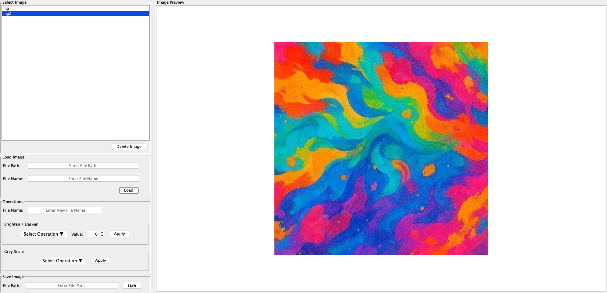
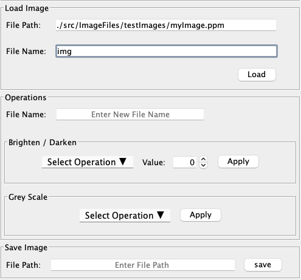
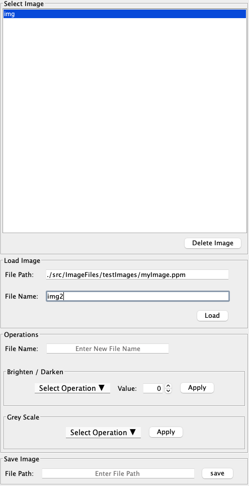
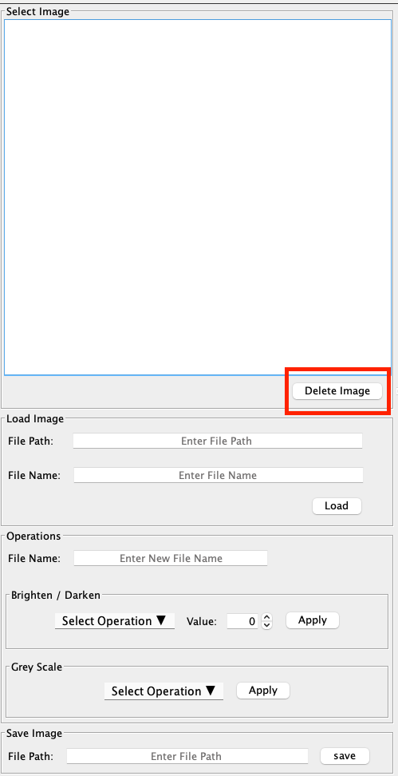
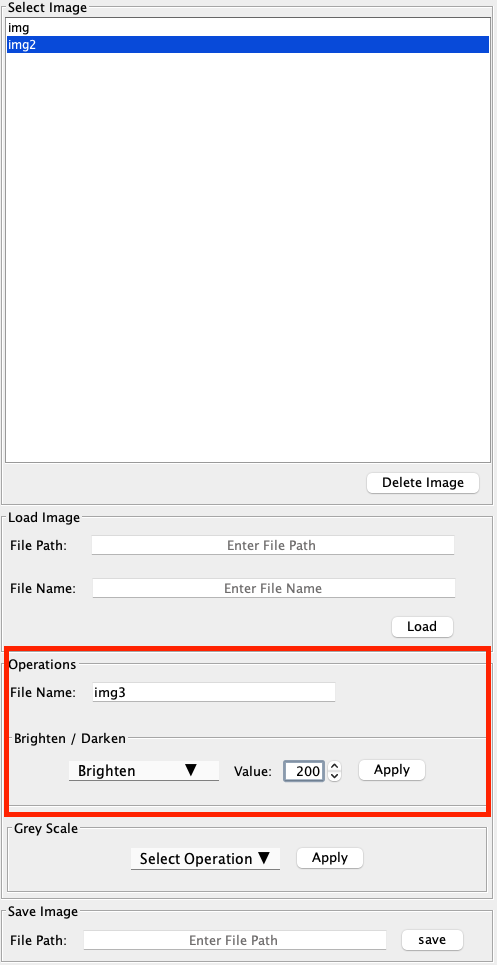
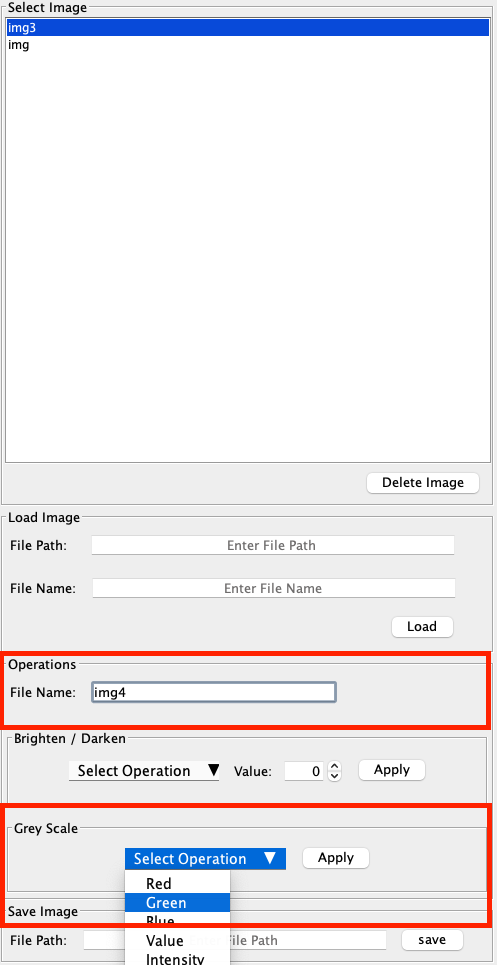
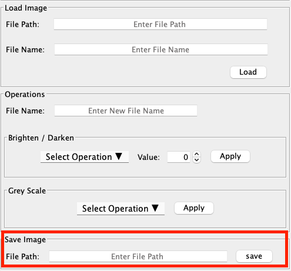

# Image Editor

## Overview:
This is a command and GUI based program that allows users to load alter and save images.
Images must be loaded and saved in one of the following formats:

### Usable File Extensions
- .ppm
- .jpeg
- .png
- .bmp

#### The image editor program allows you to:
-  Load images from a file path and store them for later editing.
-  Perform image editing by applying one of the following commands:

- #### Usable Operations
    - Brighten by value 0 - 255
    - Darken by value 0 - 255
    - Red grey scale
    - Green grey scale
    - Blue grey scale
    - Value grey scale
    - Intensity grey scale
    - Luma grey scale

- View the image loaded or edited
- Save the modified image to a new file path

## How to Use
### Load Images:
#### GUI
You can load images into the GUI by entering the file path of the image into the file path field, the desired
file name into the tile name field and pressing load within the load image pane of the window. After pressing
load your image name will appear in the Select image pane. You must use one of the listed file extensions to load the image.

#### Command Line
You can load images using the command line by typing the following into your terminals command line:

     load example.ext filename

You use the command load followed by the file path then finally the desired file name.

### Delete Images:
#### GUI
You can delete images by selecting the image you want to delete from the select image pane. Then navigate to the
delete button at the bottom of the select image pane. Once selected your image will be deleted.

#### Command Line
There currently is no command to delete the image using command line. This is a future feature add.

### Brighten Darken Operations:
#### GUI
The brighten and darken operations brighten or darken the selected image by the desired value between 0 - 255.
To perform the brighted or darken operation you must select the desired image to be edited. Then navigate to the
operations panel and provide the desired new name for the image. Then select the brighten or darken 
operation from the dropdown menu with in the brighten / darken panel. Select the desired alteration value between
0 and 255. For brighten 255 is as bright as it can be for darken 255 is as dark as it can be. Finally select apply 
to apply the operation to the selected image. Finally select apply to apply the operation to the selected image. 
The previous unaltered image will be deleted. There is currently now revert alteration but this will be a future implementation.

#### Command Line
You can perform the brighten/ darken operations using the command line by typing the following into 
your terminals command line:

    brighten value imageName newImageName
    darken value imageName newImageName

Use the brighten or darken command followed by a value 0 - 255 then the name of the image you want to alter and the new name
for the altered image.

### GreyScale Operations:
#### GUI
To perform the grey scale operation you must select the desired image to be edited. Then navigate to the
operations panel and provide the desired new name for the image. Then select one of the following operations from 
the dropdown menu within the grey scale operations panel:
- Red grey scale
- Green grey scale
- Blue grey scale
- Value grey scale
- Intensity grey scale
- Luma grey scale
 
Finally select apply to apply the operation to the selected image. The previous unaltered image will be deleted.
There is currently now revert alteration but this will be a future implementation.

#### Command Line
You can perform the grey scale operations using the command line by typing the following into
your terminals command line:

    greyscale(i.e red, bue, green ...) imageName newImageName

Use the grey scale command followed then the name of the image you want to alter and the new name
for the altered image.

### Save:
#### GUI
To save the image first select the image in the select image pane. Next navigate to the save pane at the 
bottom of the window. Enter the desired file path to save the image to using one of the valid extensions listed.
Finally press the save image button. Once you press save the image will be removed from the select image panel
and will no longer be visible.

#### Command
You can save images using the command line by typing the following into your terminals command line:

     save example.ext filename

You use the command save followed by the file path you want to save to then finally the image name of the 
image you want to save.

### Image Preview:
#### GUI
The image preview displays the image loaded selected or altered in the pane to the right side of the 
window. This pane refreshes automatically.

#### Command
There is now display feature for command line interaction.